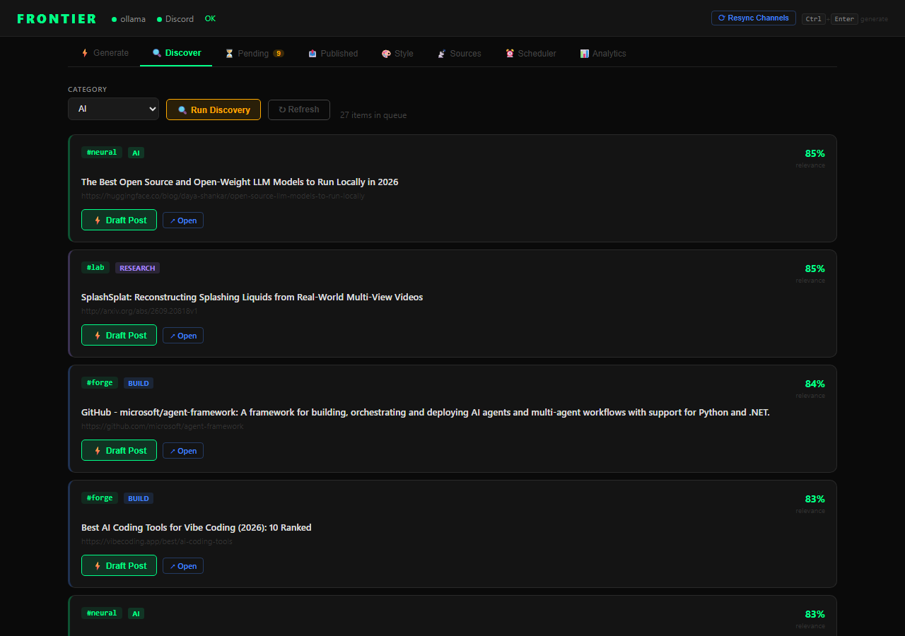
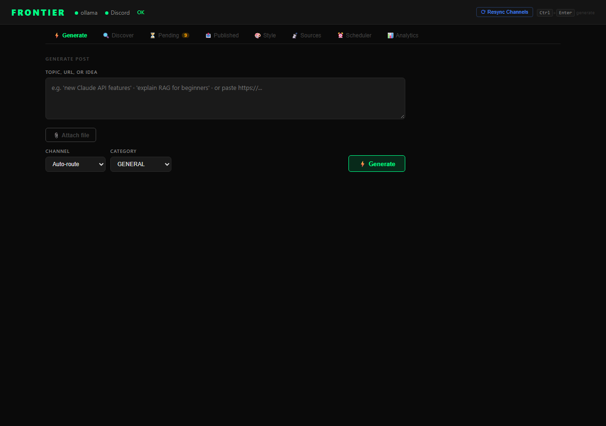
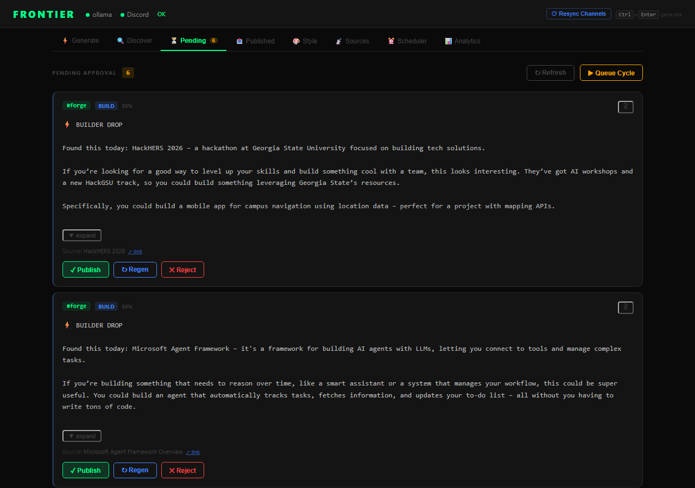
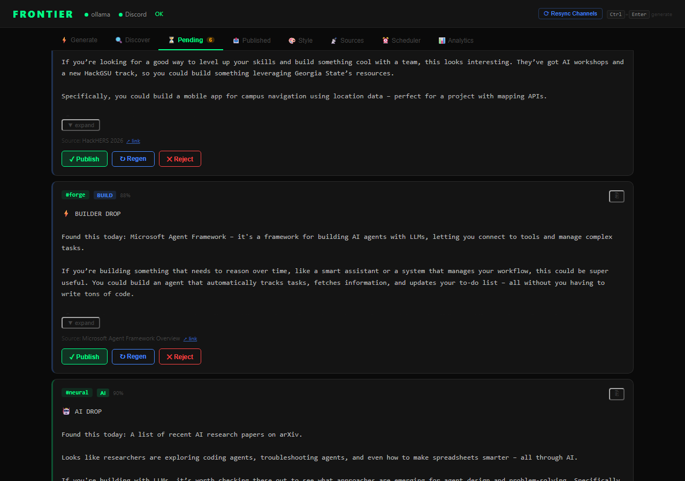

# ⚡ FRONTIER

**Local AI Community Agent** for a university student tech community Discord server.

FRONTIER discovers content, generates posts in your writing style using a **local LLM**, and publishes to the right Discord channel — with human approval before anything goes live.

---

## What it does

```
💻 Windows starts → FRONTIER starts → LLM available → discover content
→ generate in your tone → choose channel → human approval → Discord
```

---

## Phase 1 (this build)

- ✅ FastAPI backend with REST API
- ✅ Local LLM abstraction (Ollama + LM Studio)
- ✅ MCP server with FastMCP tools
- ✅ Discord bot with slash commands + inline approve/reject/regenerate buttons
- ✅ Human approval workflow (never auto-publishes without approval)
- ✅ React dashboard (Generate → Preview → Approve → Publish)
- ✅ SQLite database with full post lifecycle tracking
- ✅ Windows service installer + system tray app
- ✅ Channel routing (10 FRONTIER channels)
- ✅ Style examples system

---

## Quick Start

### 1. Setup

```powershell
cd "C:\Users\Jeyadev\Documents\FRONTIER"
.\scripts\setup.ps1
```

### 2. Configure `.env`

```env
DISCORD_BOT_TOKEN=your-bot-token
DISCORD_GUILD_ID=your-server-id
OLLAMA_MODEL=llama3.2
```

### 3. Create Discord bot

1. Go to https://discord.com/developers/applications
2. Create New Application → Bot → Copy token → paste into `.env`
3. Enable: Message Content Intent, Server Members Intent
4. Invite to server with permissions: Send Messages, Embed Links, Attach Files
5. Copy Guild ID (Server Settings → right-click server → Copy ID)

### 4. Start

```powershell
# Make sure Ollama is running first:
# ollama serve

.\.venv\Scripts\python.exe run.py
```

API docs: http://localhost:8000/docs

### 5. Dashboard (separate terminal)

```powershell
cd dashboard
npm run dev
```

Dashboard: http://localhost:5173

---

## Auto-start on Windows boot

```powershell
# Install as background service (requires admin)
.\scripts\install-service.ps1

# Or start with system tray icon
.\scripts\start-tray.ps1
```

---

## MCP Server (for Claude Code / AI agents)

```powershell
.\.venv\Scripts\python.exe -m mcp.server
```

Add to Claude Code MCP config:
```json
{
  "mcpServers": {
    "frontier": {
      "command": "python",
      "args": ["-m", "mcp.server"],
      "cwd": "C:\\Users\\Jeyadev\\Documents\\FRONTIER"
    }
  }
}
```

---

## Discord Channels

| Channel | Content |
|---------|---------|
| `#neural` | AI, LLM, machine learning |
| `#forge` | Projects, GitHub, coding |
| `#lab` | Research papers, Overleaf |
| `#arena` | Hackathons, competitions |
| `#bug-hunt` | Debugging, technical help |
| `#missions` | FRONTIER challenges |
| `#launchpad` | Student project showcases |
| `#signal` | Announcements |
| `#frontier-guide` | Guides and tutorials |
| `#frontier-lounge` | General |

---

## Style Examples

Add your own writing examples to guide the AI's tone:

```
style_examples/
├── ai/example_001.txt        ← paste your AI posts here
├── research/example_001.txt
├── hackathons/example_001.txt
└── general/example_001.txt
```

Or via MCP: `add_style_example(category="ai", example_text="...")`

---

## Architecture

```
FRONTIER/
├── backend/          FastAPI + SQLite + LLM providers
├── mcp/              FastMCP server (tools for AI agents)
├── bot/              Discord.py bot + slash commands
├── dashboard/        React + Vite control center
├── config/           Channel config YAML
├── style_examples/   Writing style reference texts
├── scripts/          PowerShell install/start/stop
├── run.py            Main runner (starts all services)
└── tray.py           Windows system tray app
```

---

## Screenshots

### Discover Tab — Hackathon Queue


### Generate Post


### Approve & Publish


### Published History

